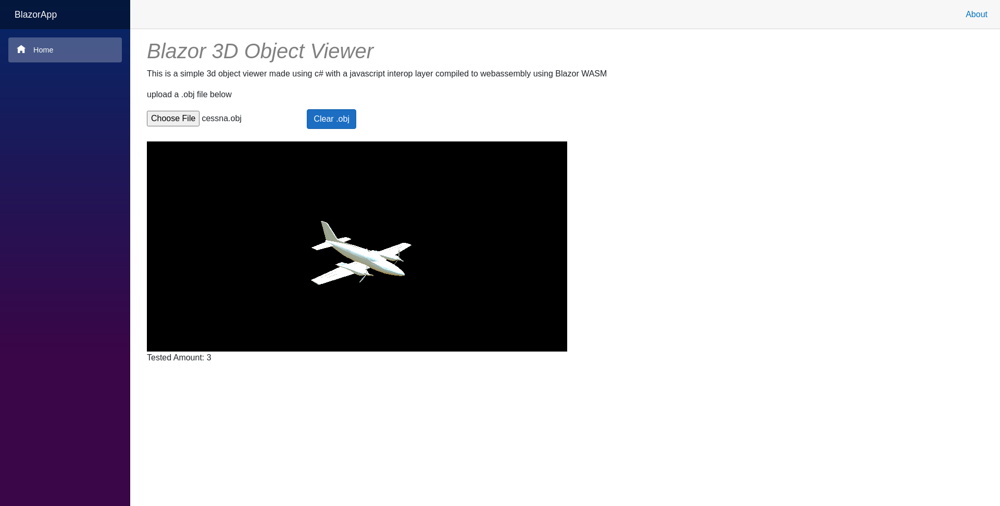

# Blazor Web Assembly Dynamic 3D .obj Model Viewer
This is a Blazor WebAssembly app which uses Javascript interoperability to allow a user to upload and view a 3D model in their browser. It could also potentially be ported to alternative Blazor platform integrations and serve as an example of a platform agnostic desktop application. 

## Developer Guide
Linux debug
- Install .Net 6
- cd to project location
- Run debug command - `dotnet watch run --project BlazorApp.csproj`

## Built With
the following **libraries :**
- [three.js](https://github.com/mrdoob/three.js/)
- [OBJLoader2.js](https://github.com/kaisalmen/WWOBJLoader)

## References and Useful Links
- [Uploading Files in Blazor](https://docs.microsoft.com/en-us/aspnet/core/blazor/file-uploads?view=aspnetcore-6.0&pivots=webassembly)
- [Collection of .obj test files (**GNU LGPL license**)](https://people.sc.fsu.edu/~jburkardt/data/obj/obj.html)

## License
[MIT License](https://github.com/kor-pixel/Blazor-Web-Assembly-Dyanmic-3D-.obj-Model-Viewer/blob/main/LICENSE)

